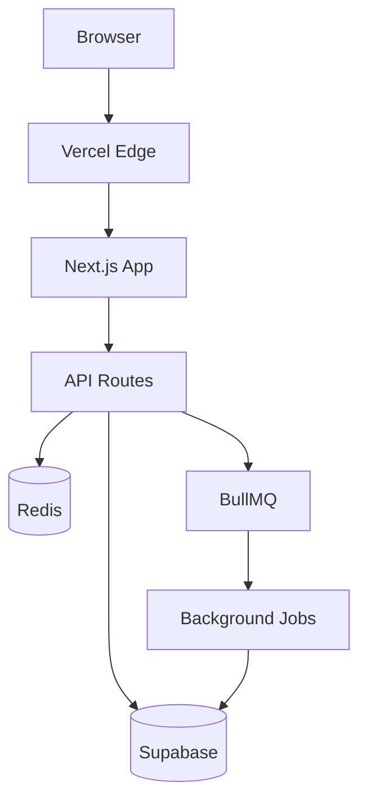
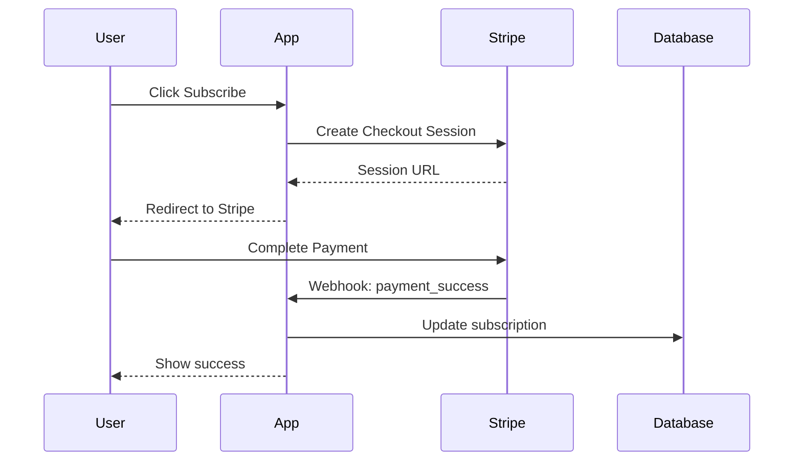
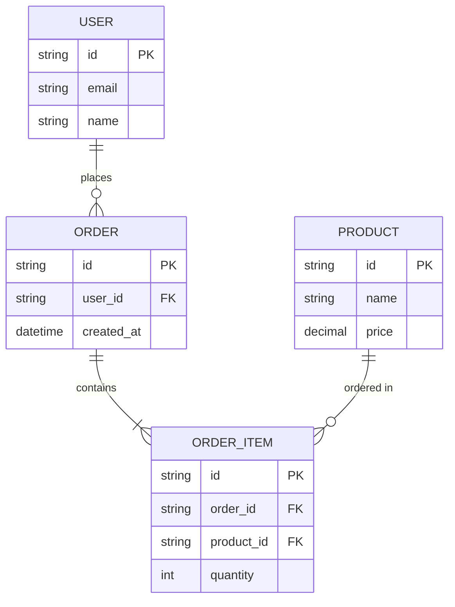
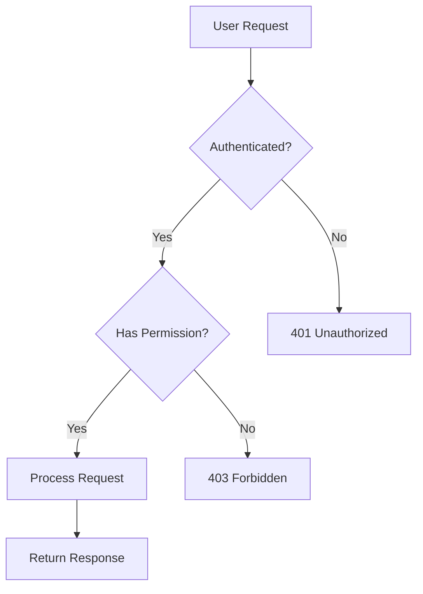

# Technical Documentation

Good docs = fewer questions = faster teams.

---

## Context Questions

Before writing documentation:

1. **Who is the audience?** — Developers, end users, stakeholders
2. **What's the project stage?** — New project, mature codebase, handoff
3. **What needs documenting?** — Setup, API, architecture, tutorials
4. **How often does it change?** — Stable vs rapidly evolving
5. **Where will docs live?** — README, docsite, wiki, inline

---

## Dimensions

| Dimension | Spectrum |
|-----------|----------|
| **Audience** | Internal devs ←→ External users |
| **Depth** | Quick start ←→ Full reference |
| **Format** | Inline comments ←→ Docsite (Docusaurus) |
| **Maintenance** | Set-and-forget ←→ Living docs (versioned) |
| **Tooling** | Markdown files ←→ Generated (OpenAPI, TypeDoc) |

---

## Derivation Logic

| If Context Is... | Then Consider... |
|------------------|------------------|
| Open source project | README + CONTRIBUTING + CHANGELOG |
| Internal API | OpenAPI spec + inline JSDoc |
| Architecture decisions | ADRs (Architecture Decision Records) |
| Complex system | Mermaid diagrams + architecture docs |
| New team members | Getting started guide + project structure |
| Client handoff | Full docs folder + README + deployment guide |

---

## TL;DR

| Doc Type | When to Use |
|----------|-------------|
| **README** | Every project, first thing people see |
| **API Docs** | Public APIs, internal services |
| **ADRs** | Significant architecture decisions |
| **Changelog** | Every release |
| **Diagrams** | Complex systems, onboarding |

---


## Part 1: README Structure

### Template

```markdown
# Project Name

One-line description of what this does.

## Quick Start

\`\`\`bash
# Install
npm install

# Run
npm run dev
\`\`\`

## Features

- Feature 1
- Feature 2
- Feature 3

## Tech Stack

- Next.js 16.1.1
- TypeScript
- Supabase

## Project Structure

\`\`\`
src/
├── app/           # Routes
├── components/    # UI components
├── lib/           # Utilities
└── types/         # TypeScript types
\`\`\`

## Environment Variables

\`\`\`bash
DATABASE_URL=         # Supabase connection string
NEXT_PUBLIC_API_URL=  # API base URL
\`\`\`

## Development

\`\`\`bash
npm run dev      # Start dev server
npm run build    # Production build
npm run test     # Run tests
\`\`\`

## Deployment

Deployed on Vercel. Push to `main` triggers deploy.

## License

MIT
```

### README Checklist

- [ ] One-line description (what, not how)
- [ ] Quick start that actually works
- [ ] Environment variables documented
- [ ] Project structure (if non-obvious)
- [ ] How to run locally

---

## Part 2: API Documentation

### OpenAPI/Swagger

```yaml
# openapi.yaml
openapi: 3.0.3
info:
  title: My API
  version: 1.0.0
  description: Brief description

servers:
  - url: https://api.example.com/v1

paths:
  /users:
    get:
      summary: List users
      description: Returns paginated list of users
      parameters:
        - name: page
          in: query
          schema:
            type: integer
            default: 1
        - name: limit
          in: query
          schema:
            type: integer
            default: 20
      responses:
        '200':
          description: Success
          content:
            application/json:
              schema:
                type: object
                properties:
                  data:
                    type: array
                    items:
                      $ref: '#/components/schemas/User'
                  meta:
                    $ref: '#/components/schemas/Pagination'

components:
  schemas:
    User:
      type: object
      properties:
        id:
          type: string
        email:
          type: string
        name:
          type: string
```

### Inline API Docs (JSDoc)

```typescript
/**
 * Create a new user account.
 * 
 * @param email - User's email address (must be unique)
 * @param name - Display name
 * @param role - User role (default: "member")
 * @returns The created user object
 * @throws {ConflictError} If email already exists
 * 
 * @example
 * const user = await createUser({
 *   email: "john@example.com",
 *   name: "John Doe"
 * });
 */
export async function createUser(data: CreateUserInput): Promise<User> {
  // ...
}
```

### Endpoint Documentation Pattern

```markdown
## POST /api/users

Create a new user.

### Request

\`\`\`json
{
  "email": "user@example.com",
  "name": "John Doe",
  "role": "member"
}
\`\`\`

### Response

**201 Created**
\`\`\`json
{
  "id": "usr_123",
  "email": "user@example.com",
  "name": "John Doe",
  "createdAt": "2026-01-26T00:00:00Z"
}
\`\`\`

**400 Bad Request**
\`\`\`json
{
  "error": "VALIDATION_ERROR",
  "message": "Email is required"
}
\`\`\`

**409 Conflict**
\`\`\`json
{
  "error": "EMAIL_EXISTS",
  "message": "Email already registered"
}
\`\`\`
```

---

## Part 3: Architecture Decision Records (ADRs)

### ADR Template

```markdown
# ADR-001: Use Supabase for Database

**Date:** 2026-01-26
**Status:** Accepted
**Deciders:** @frank, @team

## Context

We need a database for the new project. Options considered:
- PostgreSQL (self-hosted)
- PlanetScale (MySQL)
- Supabase (PostgreSQL + extras)

## Decision

Use **Supabase**.

## Rationale

1. **Built-in auth** — Saves 2-3 days of auth implementation
2. **Real-time** — WebSocket subscriptions included
3. **Row-level security** — Security built into DB layer
4. **Generous free tier** — Good for MVP

## Consequences

### Positive
- Faster time to MVP
- Less infrastructure to manage
- Good DX with TypeScript generation

### Negative
- Vendor lock-in
- Less control than self-hosted
- Learning curve for RLS

## Alternatives Rejected

- **PlanetScale**: No built-in auth, MySQL syntax
- **Self-hosted Postgres**: Too much ops overhead for small team
```

### ADR File Naming

```
docs/
└── adr/
    ├── 0001-use-supabase.md
    ├── 0002-choose-next-js.md
    ├── 0003-state-management.md
    └── README.md  # Index of all ADRs
```

### When to Write an ADR

| Write ADR | Don't Need ADR |
|-----------|----------------|
| Database choice | Library version update |
| Auth strategy | Bug fixes |
| API design patterns | Refactoring |
| Major framework choice | Style changes |
| Breaking changes | Feature additions |

---

## Part 4: Changelog

### Keep a Changelog Format

```markdown
# Changelog

All notable changes to this project.

## [Unreleased]

### Added
- New feature X

## [1.2.0] - 2026-01-26

### Added
- User avatar uploads
- Dark mode toggle

### Changed
- Improved dashboard performance
- Updated pricing page design

### Fixed
- Login redirect bug on Safari
- Memory leak in real-time subscriptions

### Removed
- Deprecated v1 API endpoints

## [1.1.0] - 2025-12-20

### Added
- Team invitations
- Billing portal
```

### Changelog Best Practices

| Do | Don't |
|----|-------|
| Group by type (Added, Fixed, etc.) | Mix everything together |
| Write for users, not developers | Use commit messages |
| Link to PRs/issues | Leave out context |
| Date each release | Skip versions |

### Auto-Generate from Commits

```bash
# If using conventional commits
npm install -g conventional-changelog-cli
conventional-changelog -p angular -i CHANGELOG.md -s
```

---

## Part 5: Diagrams with Mermaid

### System Architecture



### Sequence Diagram



### Entity Relationship



### Flowchart



### Where to Put Diagrams

| Location | Use Case |
|----------|----------|
| README | High-level architecture |
| ADR | Decision context |
| /docs folder | Detailed technical docs |
| PR description | Change explanation |

---

## Part 6: Documentation as Code

### Folder Structure

```
docs/
├── README.md           # Docs home
├── getting-started.md  # Setup guide
├── architecture.md     # System overview
├── api/
│   ├── README.md       # API overview
│   ├── users.md        # Users endpoints
│   └── orders.md       # Orders endpoints
├── adr/
│   ├── README.md       # ADR index
│   └── 0001-*.md       # Individual ADRs
└── guides/
    ├── deployment.md   # How to deploy
    └── debugging.md    # Common issues
```

### Docusaurus Setup (If Needed)

```bash
npx create-docusaurus@latest docs classic
cd docs
npm start
```

### GitHub Wiki Alternative

For simpler projects, use GitHub wiki or just markdown files in `/docs`.

---

## Checklist

Documentation complete when:

- [ ] README has quick start that works
- [ ] All env vars documented
- [ ] API endpoints documented
- [ ] Major decisions have ADRs
- [ ] Changelog updated per release
- [ ] Architecture diagram exists
- [ ] Setup instructions tested by someone else

---

## Resources

- [Keep a Changelog](https://keepachangelog.com)
- [ADR GitHub](https://adr.github.io)
- [Mermaid Live Editor](https://mermaid.live)
- [OpenAPI Spec](https://swagger.io/specification/)

---

## Related Skills

- `tech-communication/SKILL.md` — Presenting docs to stakeholders
- `version-control/SKILL.md` — Commit message conventions
- `testing/SKILL.md` — Docs for test patterns
