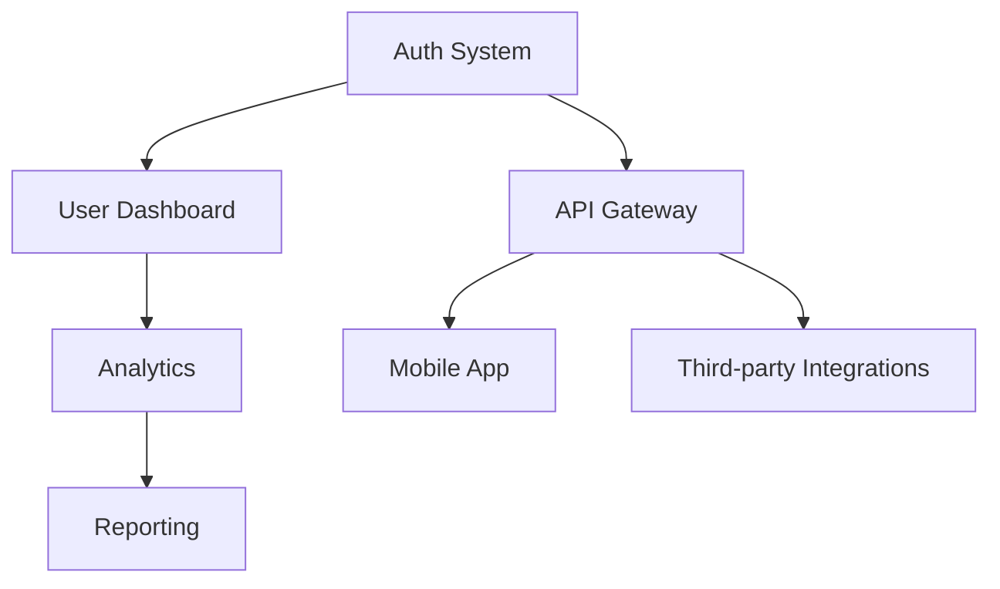

# Technical Leadership

Lead teams and make architecture decisions.

> **See also:** `agents/documentation/SKILL.md`, `agents/tech-communication/SKILL.md`

---

## Context Questions

Before leading technical initiatives:

1. **What's your role?** — Tech lead, staff engineer, architect, manager
2. **What's the scope?** — Single project, team, organization-wide
3. **What's the decision type?** — Architecture, process, hiring, tooling
4. **Who are the stakeholders?** — Engineers, PMs, executives, external
5. **What's the timeline?** — Sprint, quarter, year, multi-year

---

## Dimensions

| Dimension | Spectrum |
|-----------|----------|
| **Scope** | Project ←→ Organization |
| **Reversibility** | Two-way door ←→ One-way door |
| **Time Horizon** | Sprint ←→ Multi-year |
| **Stakeholders** | Technical ←→ Executive |
| **Collaboration** | Individual ←→ Cross-functional |

---

## Derivation Logic

| If Context Is... | Then Consider... |
|------------------|------------------|
| One-way door decision | ADR required, broad review, take time |
| Two-way door decision | Move fast, iterate, document later |
| Executive stakeholders | BLUF format, business impact focus |
| Engineering team | Technical details, code examples |
| New team member | Mentorship, pairing, growth plan |
| Quarterly planning | Roadmap template, dependency mapping |

---

## TL;DR

| Skill | Purpose |
|-------|---------|
| **ADRs** | Document architecture decisions |
| **Roadmaps** | Plan technical direction |
| **Communication** | Explain to stakeholders |
| **Mentorship** | Grow team members |

---

## Part 1: Architecture Decision Records (ADRs)

### What is an ADR?

Short document capturing a significant architecture decision:
- What was decided
- Why it was decided
- What alternatives were considered

### ADR Template

```markdown
# ADR-001: Use PostgreSQL for Primary Database

## Status
Accepted

## Context
We need a primary database for our application. Requirements:
- Relational data with complex queries
- ACID compliance
- Team familiarity
- Good ORM support

## Decision
We will use PostgreSQL as our primary database.

## Alternatives Considered

### MySQL
- Pros: Widely used, fast for simple queries
- Cons: Less feature-rich, weaker JSON support
- Why not: Postgres better for our use case

### MongoDB
- Pros: Flexible schema, good for documents
- Cons: No ACID, need joins
- Why not: Our data is relational

### PlanetScale (MySQL)
- Pros: Serverless, branching
- Cons: Lock-in, cost at scale
- Why not: Want more control

## Consequences
- Team needs Postgres knowledge
- Use Prisma as ORM
- Deploy on Supabase or Neon

## Date
2024-01-15
```

### When to Write ADRs

✅ Write for:
- Database/infrastructure choices
- Framework or language decisions
- Security architecture
- Integration patterns
- Breaking API changes

❌ Skip for:
- Library updates
- Bug fixes
- Routine refactors

### Store ADRs

```
docs/
└── adr/
    ├── 001-use-postgres.md
    ├── 002-adopt-next-app-router.md
    ├── 003-authentication-with-clerk.md
    └── template.md
```

---

## Part 2: Technical Roadmaps

### Quarterly Planning

```markdown
# Q1 2025 Technical Roadmap

## Theme: Foundation & Scale

### Month 1: Infrastructure
- [ ] Migrate to Kubernetes
- [ ] Set up staging environment
- [ ] Implement CI/CD pipeline

### Month 2: Performance
- [ ] Database optimization
- [ ] CDN for static assets
- [ ] API response caching

### Month 3: Security
- [ ] SOC2 compliance prep
- [ ] Security audit
- [ ] Penetration testing

## Success Metrics
- API latency < 200ms p95
- Zero critical security findings
- Deploy time < 10 minutes

## Dependencies
- DevOps hire (Month 1)
- Security consultant (Month 3)

## Risks
| Risk | Likelihood | Impact | Mitigation |
|------|------------|--------|------------|
| K8s complexity | Medium | High | Start with managed service |
| Scope creep | High | Medium | Weekly prioritization |
```

### Milestone Definition

```markdown
## Milestone: v2.0 Launch

### Definition of Done
- [ ] All P0 features complete
- [ ] Performance benchmarks met
- [ ] Security review passed
- [ ] Documentation updated
- [ ] Rollback plan tested

### Features
- [ ] New onboarding flow
- [ ] Team collaboration
- [ ] API v2

### Date: March 15, 2025
```

### Dependency Mapping



---

## Part 3: Stakeholder Communication

### Status Updates (Exec Level)

```markdown
## Weekly Update: Jan 15, 2025

### TL;DR
On track for Q1 goals. One risk flagged.

### Progress
✅ Kubernetes migration complete
✅ Staging environment live
🔄 CI/CD pipeline (80% done)

### Metrics
| Metric | Last Week | This Week | Target |
|--------|-----------|-----------|--------|
| Uptime | 99.8% | 99.9% | 99.9% |
| Deploy Time | 25m | 12m | <10m |
| API Latency | 180ms | 165ms | <200ms |

### Risk
**CI/CD delay risk**: GitHub Actions quota exceeded
- Impact: May delay by 1 week
- Mitigation: Upgrade to Team plan ($4/mo)
- Decision needed: Approve budget increase?

### Next Week
- Complete CI/CD
- Start performance optimization
```

### Technical → Non-Technical

**Bad:** "We refactored the monolith into microservices using gRPC for inter-service communication."

**Good:** "We split our system into smaller pieces that can be updated independently. This means faster feature delivery and fewer bugs affecting the whole system."

### Frameworks

**BLUF (Bottom Line Up Front)**
```
The migration will take 3 weeks and cost $5,000.

Here's why: [details]
```

**Pyramid Principle**
```
1. Conclusion: We should use Vercel
2. Key reasons:
   a. 50% faster deploys
   b. Better DX
   c. Cost neutral
3. Supporting evidence: [data]
```

---

## Part 4: Tradeoff Frameworks

### "It Depends" → Structured Decision

| Option | Speed | Cost | Complexity | Reversibility |
|--------|-------|------|------------|---------------|
| Build | Slow | High | High | Easy |
| Buy | Fast | Medium | Low | Hard |
| Open Source | Medium | Low | Medium | Medium |

### Cost vs Speed vs Quality

```
          Quality
            /\
           /  \
          /    \
         /  ✓   \
        /        \
       /----------\
      /            \
   Speed -------- Cost
```

Pick two. The third suffers.

### One-Way vs Two-Way Doors

**One-way door (irreversible):**
- Database choice in production
- Public API contracts
- Major architectural changes
→ Take time, get it right

**Two-way door (reversible):**
- UI component library
- Internal tooling
- Feature flags
→ Move fast, iterate

### Decision Matrix

```markdown
## Decision: Hosting Provider

| Criteria | Weight | Vercel | AWS | Railway |
|----------|--------|--------|-----|---------|
| DX | 30% | 9 | 5 | 8 |
| Cost | 25% | 6 | 8 | 7 |
| Scale | 25% | 7 | 10 | 6 |
| Features | 20% | 8 | 9 | 6 |
| **Score** | | **7.5** | 7.6 | 6.8 |

Decision: Vercel (DX outweighs slight AWS score advantage)
```

---

## Part 5: Code Review Culture

### Review Guidelines

```markdown
## Code Review Principles

### What to Check
- [ ] Does it work?
- [ ] Is it readable?
- [ ] Is it tested?
- [ ] Does it follow patterns?
- [ ] Are there security issues?

### How to Comment
✅ "Consider using X because Y"
✅ "I think this could be simplified"
✅ "Question: why did you choose X over Y?"

❌ "This is wrong"
❌ "Why would you do it this way?"
❌ "Just use X"

### Response Time
- P0 (blocking): < 2 hours
- P1 (important): < 24 hours
- P2 (normal): < 48 hours
```

### Constructive Feedback

```markdown
## Instead of → Try

"This is confusing"
→ "I had trouble understanding X. Would it help to add a comment or rename the variable?"

"This won't work"
→ "I think this might fail when Y happens. What if we add a check for Z?"

"Use X library instead"
→ "Have you considered X library? It handles Y automatically which might simplify this."
```

### Speed vs Quality Balance

- **Startup phase:** Ship fast, fix later
- **Growth phase:** Balance both
- **Enterprise phase:** Quality gates

---

## Part 6: Mentorship

### 1:1 Structure

```markdown
## Weekly 1:1 Template

### Check-in (5 min)
- How are you feeling about work?
- Anything blocking you?

### Progress (10 min)
- What did you accomplish?
- What are you working on?

### Growth (10 min)
- What did you learn?
- What skill are you developing?

### Support (5 min)
- How can I help?
- Any feedback for me?
```

### Technical Growth Plans

```markdown
## Growth Plan: Junior → Mid-Level

### Current State
- Strong: JavaScript, React
- Growing: TypeScript, testing
- Gap: System design, databases

### 3-Month Goals
1. Complete TypeScript migration (ownership)
2. Write integration tests for 2 features
3. Design and implement 1 new feature end-to-end

### Resources
- TypeScript course (company paid)
- Weekly pairing sessions
- System design book club

### Check-ins
- Bi-weekly progress review
- Monthly skills assessment
```

### Pair Programming

```markdown
## Pairing Rules

### Driver (typing)
- Implements the code
- Talks through thinking
- Asks for input

### Navigator (guiding)
- Reviews in real-time
- Suggests approaches
- Catches bugs

### Rotate every 25 minutes

### When to Pair
- Onboarding new team members
- Complex bugs
- Architecture exploration
- Knowledge transfer
```

---

## Part 7: Interview Prep

### System Design Questions

```markdown
## Approach

1. **Clarify** (2 min)
   - What's the scale?
   - What are the requirements?
   - Any constraints?

2. **High-level design** (5 min)
   - Draw boxes
   - Show data flow
   - Identify components

3. **Deep dive** (15 min)
   - Database schema
   - API design
   - Scaling approach

4. **Trade-offs** (5 min)
   - What could go wrong?
   - How would you scale?
   - What would you change?
```

### Behavioral (STAR Format)

```markdown
## STAR Template

**Situation:** Set the scene
**Task:** What was your responsibility?
**Action:** What did you do?
**Result:** What happened?

## Example

Q: Tell me about a difficult technical decision.

S: "We were scaling from 100 to 10,000 users and hitting database limits."
T: "As tech lead, I needed to solve our scaling bottleneck."
A: "I evaluated sharding, read replicas, and caching. Chose read replicas + Redis cache because it was reversible and covered 90% of queries."
R: "Latency dropped from 500ms to 80ms. Bought us 18 months of runway."
```

### Leadership Questions

```markdown
## Common Questions

1. How do you handle disagreements with stakeholders?
2. Tell me about a time you had to make a decision with incomplete information.
3. How do you prioritize technical debt vs features?
4. Describe how you've grown a team member.
5. What's your approach to introducing new technology?
```

---

## Checklist

```markdown
- [ ] ADR template created
- [ ] ADR folder in docs
- [ ] Quarterly roadmap defined
- [ ] Status update template
- [ ] Code review guidelines
- [ ] 1:1 template
- [ ] Growth plans for reports
- [ ] Interview prep documented
```

---

## Resources

- ADR Examples: <https://adr.github.io/>
- Staff Engineer Book: <https://staffeng.com/book>
- The Manager's Path: Camille Fournier
- Radical Candor: Kim Scott

---

## Related Skills

- `agents/documentation/SKILL.md` — Writing docs
- `agents/tech-communication/SKILL.md` — Proposals, tradeoffs
- `workflows/product-spec/SKILL.md` — PRDs
